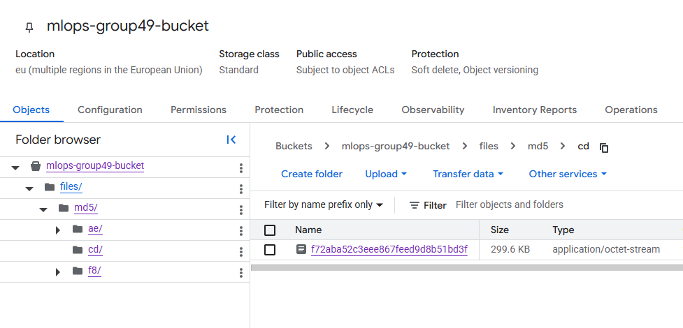
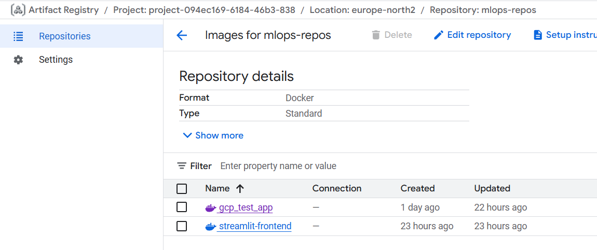
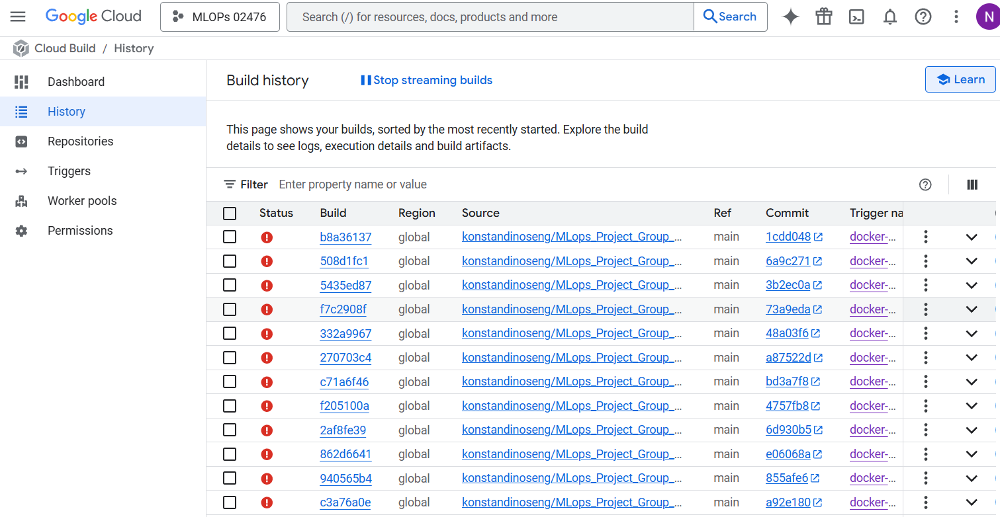
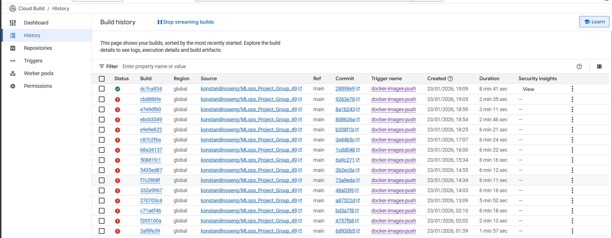

# Exam template for 02476 Machine Learning Operations

This is the report template for the exam. Please only remove the text formatted as with three dashes in front and behind
like:

```--- question 1 fill here ---```

Where you instead should add your answers. Any other changes may have unwanted consequences when your report is
auto-generated at the end of the course. For questions where you are asked to include images, start by adding the image
to the `figures` subfolder (please only use `.png`, `.jpg` or `.jpeg`) and then add the following code in your answer:

``

In addition to this markdown file, we also provide the `report.py` script that provides two utility functions:

Running:

```bash
python report.py html
```

Will generate a `.html` page of your report. After the deadline for answering this template, we will auto-scrape
everything in this `reports` folder and then use this utility to generate a `.html` page that will be your serve
as your final hand-in.

Running

```bash
python report.py check
```

Will check your answers in this template against the constraints listed for each question e.g. is your answer too
short, too long, or have you included an image when asked. For both functions to work you mustn't rename anything.
The script has two dependencies that can be installed with

```bash
pip install typer markdown
```

or

```bash
uv add typer markdown
```

## Overall project checklist

The checklist is *exhaustive* which means that it includes everything that you could do on the project included in the
curriculum in this course. Therefore, we do not expect at all that you have checked all boxes at the end of the project.
The parenthesis at the end indicates what module the bullet point is related to. Please be honest in your answers, we
will check the repositories and the code to verify your answers.

### Week 1

* [x] Create a git repository (M5)
* [x] Make sure that all team members have write access to the GitHub repository (M5)
* [x] Create a dedicated environment for you project to keep track of your packages (M2)
* [x] Create the initial file structure using cookiecutter with an appropriate template (M6)
* [x] Fill out the `data.py` file such that it downloads whatever data you need and preprocesses it (if necessary) (M6)
* [x] Add a model to `model.py` and a training procedure to `train.py` and get that running (M6)
* [x] Remember to either fill out the `requirements.txt`/`requirements_dev.txt` files or keeping your
    `pyproject.toml`/`uv.lock` up-to-date with whatever dependencies that you are using (M2+M6)
* [x] Remember to comply with good coding practices (`pep8`) while doing the project (M7)
* [x] Do a bit of code typing and remember to document essential parts of your code (M7)
* [x] Setup version control for your data or part of your data (M8)
* [x] Add command line interfaces and project commands to your code where it makes sense (M9)
* [x] Construct one or multiple docker files for your code (M10)
* [x] Build the docker files locally and make sure they work as intended (M10)
* [x] Write one or multiple configurations files for your experiments (M11)
* [x] Used Hydra to load the configurations and manage your hyperparameters (M11)
* [x] Use profiling to optimize your code (M12)
* [ ] Use logging to log important events in your code (M14)
* [x] Use Weights & Biases to log training progress and other important metrics/artifacts in your code (M14)
* [x] Consider running a hyperparameter optimization sweep (M14)
* [x] Use PyTorch-lightning (if applicable) to reduce the amount of boilerplate in your code (M15)

### Week 2

* [x] Write unit tests related to the data part of your code (M16) -
* [x] Write unit tests related to model construction and or model training (M16)
* [ ] Calculate the code coverage (M16)
* [x] Get some continuous integration running on the GitHub repository (M17)
* [x] Add caching and multi-os/python/pytorch testing to your continuous integration (M17)
* [x] Add a linting step to your continuous integration (M17)
* [x] Add pre-commit hooks to your version control setup (M18)
* [ ] Add a continues workflow that triggers when data changes (M19)
* [ ] Add a continues workflow that triggers when changes to the model registry is made (M19)
* [x] Create a data storage in GCP Bucket for your data and link this with your data version control setup (M21)
* [x] Create a trigger workflow for automatically building your docker images (M21)
* [ ] Get your model training in GCP using either the Engine or Vertex AI (M21)
* [x] Create a FastAPI application that can do inference using your model (M22)
* [x] Deploy your model in GCP using either Functions or Run as the backend (M23)
* [x] Write API tests for your application and setup continues integration for these (M24)
* [x] Load test your application (M24)
* [ ] Create a more specialized ML-deployment API using either ONNX or BentoML, or both (M25)
* [x] Create a frontend for your API (M26)

### Week 3

* [x] Check how robust your model is towards data drifting (M27)
* [ ] Setup collection of input-output data from your deployed application (M27)
* [x] Deploy to the cloud a drift detection API (M27) (An attempt was made failed due to permissions)
* [ ] Instrument your API with a couple of system metrics (M28)
* [ ] Setup cloud monitoring of your instrumented application (M28)
* [ ] Create one or more alert systems in GCP to alert you if your app is not behaving correctly (M28)
* [ ] If applicable, optimize the performance of your data loading using distributed data loading (M29)
* [ ] If applicable, optimize the performance of your training pipeline by using distributed training (M30)
* [ ] Play around with quantization, compilation and pruning for you trained models to increase inference speed (M31)

### Extra

* [x] Write some documentation for your application (M32)
* [ ] Publish the documentation to GitHub Pages (M32)
* [x] Revisit your initial project description. Did the project turn out as you wanted?
* [x] Create an architectural diagram over your MLOps pipeline
* [ ] Make sure all group members have an understanding about all parts of the project
* [x] Uploaded all your code to GitHub

## Group information

### Question 1
> **Enter the group number you signed up on <learn.inside.dtu.dk>**
>
> Answer:

MLOps 49

### Question 2
> **Enter the study number for each member in the group**
>
> Example:
>
> *sXXXXXX, sXXXXXX, sXXXXXX*
>
> Answer:

s250219, s250201, s250269, s250173, s250155

### Question 3
> **Did you end up using any open-source frameworks/packages not covered in the course during your project? If so**
> **which did you use and how did they help you complete the project?**
>
> Recommended answer length: 0-200 words.
>
> Example:
> *We used the third-party framework ... in our project. We used functionality ... and functionality ... from the*
> *package to do ... and ... in our project*.
>
> Answer:

Yes, the way our API functioned revolves around, scraping text from a stock market article. For this reason we use Newspaper4k for the scraping.


## Coding environment

> In the following section we are interested in learning more about you local development environment. This includes
> how you managed dependencies, the structure of your code and how you managed code quality.

### Question 4

> **Explain how you managed dependencies in your project? Explain the process a new team member would have to go**
> **through to get an exact copy of your environment.**
> Answer:

We managed dependencies with uv, using `pyproject.toml` as the main file for declaring both runtime and development dependencies, and `uv.lock` to pin exact versions for reproducibility. For a new team member, the setup is straightforward: clone the repository, install uv, and run `uv sync` in the project directory. This will automatically recreate the exact environment, ensuring consistency across all machines.

A new team member would:
1. Clone the repository
2. Install uv (via curl on macOS/Linux or PowerShell on Windows)
3. Run `uv venv` to create a virtual environment
4. Activate the environment (`.venv\Scripts\activate` on Windows or `source .venv/bin/activate` on macOS/Linux)
5. Run `uv pip install -r requirements.txt` for dependencies

This ensures exact reproducibility across all team members and environments.

### Question 5

> **We expect that you initialized your project using the cookiecutter template. Explain the overall structure of your**
> **code. What did you fill out? Did you deviate from the template in some way?**

> Answer:

We did not delete any of the cookiecutter folders, but we extended the template by adding two domain-specific subpackages inside project: inference/ (scraping + retrieval + inference logic used by the API) and monitoring/ (drift detection/monitoring utilities).

The key folders we maintained and utilized:
- `src/project/` - Core ML pipeline with modules like `data.py`, `model.py`, `train.py`
- `configs/` - Configuration files for experiments
- `data/` - Raw and processed datasets
- `models/` - Trained model artifacts
- `tests/` - Unit tests for data, model, and API
- `dockerfiles/` - Container definitions for training and inference
- `notebooks/` - Jupyter notebooks for exploration

### Question 6

> **Did you implement any rules for code quality and format? What about typing and documentation? Additionally,**
> **explain with your own words why these concepts matters in larger projects.**
> Answer:

We used Ruff for both linting and formatting, configured with a line length of 120 characters in our `pyproject.toml`. For static type checking we used mypy with strict settings enabled. Documentation is built using MkDocs with the mkdocstrings-python plugin, allowing us to auto-generate API docs from docstrings. These concepts matter in larger projects because they ensure consistency across multiple contributors and reduce bugs. Linting catches style violations and potential errors early, while consistent formatting eliminates bikeshedding in code reviews. Typing enables IDE autocompletion, makes refactoring safer, and catches type mismatches before runtime. Documentation helps new team members onboard quickly and serves as a reference for API usage. For example, typing function parameters like `agreement: Literal["AllAgree", "75Agree"]` makes the API self-documenting and prevents invalid inputs at development time rather than in production.

## Version control

> In the following section we are interested in how version control was used in your project during development to
> corporate and increase the quality of your code.

### Question 7

> **How many tests did you implement and what are they testing in your code?**
> Answer:

In total we implemented 4 main test files covering critical parts of our application:
- `test_data.py` - Tests for data loading and preprocessing
- `test_data_preprocess.py` - Data transformation and validation tests
- `test_model.py` - Model construction and output validation
- `test_api.py` - API endpoint testing

These tests focus on the most critical parts of our pipeline: ensuring data integrity, model correctness, and API functionality.

### Question 8

> **What is the total code coverage (in percentage) of your code? If your code had a code coverage of 100% (or close**
> **to), would you still trust it to be error free? Explain you reasoning.**
> Answer:

We measured coverage with `pytest-cov`. Current total: **13%** (179 statements, 156 missed).

Key gaps: `src/project/backend.py` (18%), `src/project/inference/inference.py` (3%), `src/project/inference/retrieval.py` (28%). Tests were deprioritised and many paths use external I/O (wandb, artifact download, torch.load) and need mocking. Regardless even if we reached 100% code coverage,
it still wouldnt necessary that the code is error free. The tests can only go as far as their quality not their quantity. Until the middle phase of development we kept a steady 60% which seemed enough to give a reasonable error prevention. It seems with large team (we are a team of 5) ensuring everyone keeps the tests up to date is difficult.

```bash
uv run pytest -- --cov=src/project --cov-report=term-missing
```

### Question 9

> **Did you workflow include using branches and pull requests? If yes, explain how. If not, explain how branches and**
> **pull request can help improve version control.**

> Answer:

We used branches and pull requests minimally for feature development. Since team members worked at different time intervals with little overlap, we rarely had concurrent changes to the same files, making feature branches less essential for our workflow. However, we did use Dependabot for automated dependency updates, which created around 17 branches with corresponding pull requests to keep our packages up to date. This demonstrated the value of PRs for version control: branches allow isolated changes without affecting the main codebase, reducing the risk of breaking changes. Pull requests enable code review before merging, catching bugs and ensuring code quality. They also create a documented history of why changes were made. Additionally, PRs integrate well with CI pipelines, automatically running tests before code is merged, preventing regressions from reaching production.

### Question 10

> **Did you use DVC for managing data in your project? If yes, then how did it improve your project to have version**
> **control of your data. If no, explain a case where it would be beneficial to have version control of your data.**

> Answer:

We used DVC for data versioning with a Google Cloud Storage bucket as our remote storage. This was especially convenient because we didn't have to commit large data files or model checkpoints to Git—instead, we tracked `.dvc` files and used `dvc pull` to fetch the actual data when needed. We version-controlled our raw data (`Sentences_AllAgree.txt`), processed data (`phrasebank_AllAgree.pt`), and trained model (`text_model_AllAgree.pt`). When deploying our model inference on Google Cloud Run, we integrated DVC directly into our Docker images: the backend dockerfile copies the `.dvc` tracking files and runs `dvc pull` during the build process, using a service account secret key to authenticate with GCS. This allowed the container to automatically pull the correct data version without embedding large files in the image, keeping our images lightweight and ensuring reproducibility across environments.

### Question 11

> **Discuss you continuous integration setup. What kind of continuous integration are you running (unittesting,**
> **linting, etc.)? Do you test multiple operating systems, Python  version etc. Do you make use of caching? Feel free**
> **to insert a link to one of your GitHub actions workflow.**

> Answer:

Our continuous integration is managed with GitHub Actions, with workflows defined in `.github/workflows/`:

- **Unit testing** ([tests.yaml]): Runs `pytest` on all main test files (`test_data.py`, `test_model.py`, `test_api.py`, etc.) for every push and pull request to `main`. This workflow uses a matrix to test across multiple operating systems (Ubuntu, Windows, macOS) and Python versions (3.11, 3.12), ensuring our code is robust and portable. Coverage is also measured in this workflow.

- **Linting & formatting** ([linting.yaml]): Checks code quality and formatting using Ruff on every push and pull request. This ensures compliance with PEP8 and our custom style rules. The workflow installs dependencies with `uv` and runs `ruff check .` to catch lint and formatting issues early.

- **Pre-commit auto-update** ([pre-commit-update.yaml]): Automatically updates pre-commit hooks on a schedule and via manual dispatch, creating pull requests with updated hook versions. This keeps our code quality tools up to date without manual intervention.

- **Dependency caching**: Both the testing and linting workflows use dependency caching for `uv` and Python packages, significantly speeding up CI runs.

**Key features of our CI setup:**
1. All tests are run on every push and pull request, across multiple OS and Python versions.
2. Linting and formatting are enforced automatically.
3. Pre-commit hooks are kept up to date via automation.
4. Dependency caching is used to optimize workflow speed.

Example workflow files:
- `.github/workflows/tests.yaml`: Unit/matrix testing
- `.github/workflows/linting.yaml`: Linting & formatting
- `.github/workflows/pre-commit-update.yaml`: Pre-commit hook updates

This setup ensures our codebase remains reliable, consistent, and easy to maintain as the project evolves.

## Running code and tracking experiments

> In the following section we are interested in learning more about the experimental setup for running your code and
> especially the reproducibility of your experiments.

### Question 12

> **How did you configure experiments? Did you make use of config files? Explain with coding examples of how you would**
> **run a experiment.**
> Answer:

We used Hydra for experiment configuration via YAML files, loaded internally using `initialize()` and `compose()`. Our setup includes `configs/config.yaml` for main configuration and `configs/sweep.yaml` for hyperparameter sweeps. The CLI is built with Typer, allowing command-line overrides.

Example run: uv run train training.lr=0.01 training.batch_size=32

This allows flexible parameter overriding from command line (using dot notation for nested configs) while maintaining reproducibility through config files.

### Question 13

> **Reproducibility of experiments are important. Related to the last question, how did you secure that no information**
> **is lost when running experiments and that your experiments are reproducible?**

> Answer:

We secured reproducibility through multiple mechanisms:

1. **Config files** - All hyperparameters stored in YAML, no hardcoding allowing us to use the exact same parameters across the team with ease.
2. **DVC** - Data and model versioning with `.dvc` files
3. **Weights & Biases** - Every experiment run logs configurations, metrics, and artifacts. This way we ensure every expirement is easily reproducible.
4. **Random seeds** - Fixed seeds for PyTorch and NumPy in training scripts
5. **Environment pinning** - `uv.lock` ensures exact dependency versions

To reproduce an experiment: Check W&B for the run's config, retrieve the exact dataset version from DVC, install dependencies from `uv.lock`, and run with the logged hyperparameters.

### Question 14

> **Upload 1 to 3 screenshots that show the experiments that you have done in W&B (or another experiment tracking**
> **service of your choice). This may include loss graphs, logged images, hyperparameter sweeps etc. You can take**
> **inspiration from [this figure](figures/wandb.png). Explain what metrics you are tracking and why they are**
> **important.**

> Answer:
As seen in  we track how epoch, loss and other hyperparameters are affecting the accuracy of our model. We also track the accuracy of our model over the course of training.
As seen in  and , we tracked which combination of hyperparameters led to the best model, given the goal to minimize validation loss.

Detailed Explanation:
To select the best model configurations we monitored a set of core metrics across hyperparameter sweep runs:

- Training loss: Tracked to ensure the optimizer reduces error. A steady downward trend in the loss chart indicates successful convergence.
- Validation accuracy: Our primary performance metric — used to compare configurations and detect diminishing returns as training progresses.
- Epochs vs. steps: Recording progress by epoch/step ensures fair comparisons between runs and helps spot overfitting or premature stopping.

Hyperparameter visualization: the Parallel Coordinates plot (bottom image) reveals high-dimensional relationships between parameters and outcomes. We specifically inspected learning rate and batch size against validation loss to identify "paths to success" (for example, clusters where a lower learning rate combined with a certain batch size produced more stable, lower validation loss).

This approach moves model selection beyond trial-and-error by highlighting promising hyperparameter regions and guiding focused follow-up experiments.

### Question 15

> **Docker is an important tool for creating containerized applications. Explain how you used docker in your**
> **experiments/project? Include how you would run your docker images and include a link to one of your docker files.**

> Answer:

We developed multiple Docker images for different stages of the pipeline:

- **`train.dockerfile`** - For training the model
- **`backend.dockerfile`** - For serving the API
- **`frontend.dockerfile`** - For the web interface
- **`drift.dockerfile`** - For the drift detection service

Example training run:
```bash
docker build -f dockerfiles/train.dockerfile -t project-train .
```
Because we didnt have time to set a key to automatically log into the wandb we decided to disable it for the purpose of this report.
```bash
docker run -e WANDB_MODE=disabled project-train --epochs 3 --lr 1e-3 --batch-size 32
```

Dockerization ensures:
- Reproducible environments across machines
- Easy cloud deployment
- Isolation between components

### Question 16

> **When running into bugs while trying to run your experiments, how did you perform debugging? Additionally, did you**
> **try to profile your code or do you think it is already perfect?**
> Answer:

Debugging approach: We used VS Code debugger for interactive debugging, print statements for quick diagnostics, and pytest `-vv` flag for test failures.

Profiling: We implemented a dedicated profiling module (`src/project/profiling.py`) using PyTorch Profiler. This module provides a context manager `torch_profile()` that records CPU/CUDA operations, memory usage, and exports TensorBoard traces. We integrated it into our evaluation pipeline (`evaluate.py`) and can enable it via environment variable: `$env:TORCH_PROFILER="1"`. The profiler outputs tables showing time spent per operation and memory allocation, helping identify bottlenecks in our inference pipeline. The code is definitely is not perfect and we were able to improve some parts
in evaluate.py.

## Working in the cloud

> In the following section we would like to know more about your experience when developing in the cloud.

### Question 17

> **List all the GCP services that you made use of in your project and shortly explain what each service does?**
>
> Recommended answer length: 50-200 words.

> Answer:

We used the following GCP services:

- **Cloud Storage (Buckets)** - Storing raw/processed data and model artifacts.
- **Artifact Registry** - Storing Docker images for training and inference. Specifically we uploaded the backend and frontend images.
- **Cloud Build** - Automated docker image building on code push for backend and frontend images.
- **Cloud Run** - Serverless deployment of FastAPI application as well as for the streamlit deployment of the inference. You can see it here: https://streamlit-frontend-314998984110.europe-north2.run.app/

I recommend using this to test inference: https://finance.yahoo.com/news/stock-market-sounds-alarm-investors-083500308.html?guccounter=1

These services provide a complete ML ops infrastructure from data storage to model serving.

### Question 18

> **The backbone of GCP is the Compute engine. Explained how you made use of this service and what type of VMs**
> **you used?**

> Answer:

We did not use the Compute Engine for training because our model was relatively small (text classification on limited dataset) and data volume was modest.

### Question 19

> **Insert 1-2 images of your GCP bucket, such that we can see what data you have stored in it.**
> **You can take inspiration from [this figure](figures/bucket.png).**
>
> Answer:



We used a Google Cloud Storage bucket (`mlops-group49-bucket`) to store our data and model artifacts, integrated with DVC for version control. The bucket contains our raw dataset (`Sentences_AllAgree.txt`), processed tensors (`phrasebank_AllAgree.pt`), and trained model checkpoints (`text_model_AllAgree.pt`).

### Question 20

> **Upload 1-2 images of your GCP artifact registry, such that we can see the different docker images that you have**
> **stored. You can take inspiration from [this figure](figures/registry.png).**
>
> Answer:



We stored two Docker images in our GCP Artifact Registry: `gcp_test_app` (our FastAPI backend for model inference) and `streamlit_frontend` (our web interface for users to interact with the sentiment analysis model).

### Question 21

> **Upload 1-2 images of your GCP cloud build history, so we can see the history of the images that have been build in**
> **your project. You can take inspiration from [this figure](figures/build.png).**
>
> Answer:



We managed to automate the Cloud Build flow to automatically build Docker images on code pushes. However, we encountered an issue with DVC authentication inside the Cloud Build environment—the build process couldn't authenticate with our GCS bucket to pull data/model files. We attempted to add a secret key to GitHub for authentication, but ran out of time to fully resolve this. As a workaround, we uploaded a checkpoint of the trained model directly to the repository so that Cloud Build could include it in the image without needing to pull from DVC.

Update: After upload the model checkpoint to github repo the build was finally completed successfully:


### Question 22

> **Did you manage to train your model in the cloud using either the Engine or Vertex AI? If yes, explain how you did**
> **it. If not, describe why.**
>
> Recommended answer length: 100-200 words.
>
> Example:
> *We managed to train our model in the cloud using the Engine. We did this by ... . The reason we choose the Engine*
> *was because ...*
>
> Answer:

We did not require cloud training because our model is lightweight and trains quickly (< 1 hour) on local hardware, so we chose to develop locally. However, we architected our pipeline to be fully cloud-ready. By containerizing our training workflow with Docker and managing data via DVC we ensured that scaling to Vertex AI or Compute Engine would only require deploying our existing images. So, we could do it if we needed to.

## Deployment

### Question 23

> **Did you manage to write an API for your model? If yes, explain how you did it and if you did anything special. If**
> **not, explain how you would do it.**
>
> Recommended answer length: 100-200 words.
>
> Example:
> *We did manage to write an API for our model. We used FastAPI to do this. We did this by ... . We also added ...*
> *to the API to make it more ...*
>
> Answer:

We implemented a FastAPI application (`src/project/backend.py`) with the following features:
- Accepts a URL to a financial news article as input
- Scrapes the article content using Newspaper4k
- Runs sentiment classification on extracted sentences
- Returns overall sentiment, sentiment distribution, and per-sentence predictions

The API has three endpoints: `/` and `/health` for health checks, and `/analyze` for inference. We used Pydantic models (`InferenceRequest`, `AnalysisResponse`) for request/response validation with proper typing. The API also includes GCS logging for drift detection—each inference request is logged as JSON to a Cloud Storage bucket for later analysis. Auto-generated Swagger documentation is available at `/docs`.


### Question 24

> **Did you manage to deploy your API, either in locally or cloud? If not, describe why. If yes, describe how and**
> **preferably how you invoke your deployed service?**
>
> Recommended answer length: 100-200 words.
>
> Example:
> *For deployment we wrapped our model into application using ... . We first tried locally serving the model, which*
> *worked. Afterwards we deployed it in the cloud, using ... . To invoke the service an user would call*
> *`curl -X POST -F "file=@file.json"<weburl>`*
>
> Answer:

We deployed our FastAPI application using Cloud Run. We wrapped the model in a FastAPI container and successfully tested locally with `uvicorn`. The API is deployed at: https://simple-gcp-app-314998984110.europe-north2.run.app/

The API accepts a URL to a financial article, scrapes the content using Newspaper4k, and returns sentiment analysis results. Users invoke the `/analyze` endpoint via HTTP:
```bash
curl -X POST "https://simple-gcp-app-314998984110.europe-north2.run.app/analyze" \
  -H "Content-Type: application/json" \
  -d '{"url": "https://finance.yahoo.com/news/stock-market-sounds-alarm-investors-083500308.html?guccounter=1"}'
```

The response includes overall sentiment, sentiment distribution, and per-sentence predictions. Cloud Run provides serverless deployment with automatic scaling and zero infrastructure management. For clear resuls we recommend using the front end API that we have pushed on cloud run.

### Question 25

> **Did you perform any functional testing and load testing of your API? If yes, explain how you did it and what**
> **results for the load testing did you get. If not, explain how you would do it.**
>
> Recommended answer length: 100-200 words.
>
> Example:
> *For functional testing we used pytest with httpx to test our API endpoints and ensure they returned the correct*
> *responses. For load testing we used locust with 100 concurrent users. The results of the load testing showed that*
> *our API could handle approximately 500 requests per second before the service crashed.*
>
> Answer:

For functional testing, we used `pytest` and `fastapi.testclient.TestClient` to verify our API endpoints. This allowed us to check for:
- Correct response formats (JSON structure) and HTTP status codes (200 OK, etc.)
- Accurate model predictions on known test cases
- Proper error handling for invalid inputs and edge cases

For load testing, we utilized `locust` to simulate traffic and assess performance under concurrent requests. We defined a `locustfile.py` to mimic user behavior and ran tests to check the system’s responsiveness and stability. The command uv run locust -f tests/performancetests/locustfile.py --host http://localhost:8000 was used. This confirmed our API is working locally and can handle multiple requests efficiently without errors.

### Question 26

> **Did you manage to implement monitoring of your deployed model? If yes, explain how it works. If not, explain how**
> **monitoring would help the longevity of your application.**
>
> Recommended answer length: 100-200 words.
>
> Example:
> *We did not manage to implement monitoring. We would like to have monitoring implemented such that over time we could*
> *measure ... and ... that would inform us about this ... behaviour of our application.*
>
> Answer:

We did not implement full monitoring for our deployed model. However, monitoring would significantly help the longevity of our application. With monitoring, we could track metrics such as request latency, error rates, and prediction confidence scores over time. This would inform us about degradation in model performance or unexpected API behavior.

A simple approach we could have taken: use Cloud Run's built-in metrics (request count, latency, CPU/memory usage) visible in GCP Console, and set up alerts when error rates exceed a threshold. For model-specific monitoring, we could have added a simple endpoint that logs prediction distributions to Cloud Storage, then periodically compared these against our training distribution to detect drift. Even basic logging of prediction counts per sentiment class would help identify if the model starts behaving unexpectedly.

## Overall discussion of project

> In the following section we would like you to think about the general structure of your project.

### Question 27

> **How many credits did you end up using during the project and what service was most expensive? In general what do**
> **you think about working in the cloud?**
>
> Recommended answer length: 100-200 words.
>
> Example:
> *Group member 1 used ..., Group member 2 used ..., in total ... credits was spend during development. The service*
> *costing the most was ... due to ... . Working in the cloud was ...*
>
> Answer:

Google cloud was great as a learning experience. However at times the management of prediction and with the time constraints of the course it felt like
we were forced to ''vibe code'' our way into figuring out the permissions we needed instead of truly figuring out what each permission did and why it
was important.

In terms of cloud credits our use was basically minimal because:
- Most development was local initially especially due to the small size of the model and the data (~600kb).
- Cloud run deploymenets were used only for model inference since we didnt train the model on the cloud.
- Uploading project images.

Overall cloud experience: Cloud storage was the most expensive one and we used it for storing the dataset and images.

### Question 28

> **Did you implement anything extra in your project that is not covered by other questions? Maybe you implemented**
> **a frontend for your API, use extra version control features, a drift detection service, a kubernetes cluster etc.**
> **If yes, explain what you did and why.**
>
> Recommended answer length: 0-200 words.
>
> Example:
> *We implemented a frontend for our API. We did this because we wanted to show the user ... . The frontend was*
> *implemented using ...*
>
> Answer:

We implemented an additional drift detection component to monitor whether incoming inference data starts to differ from the data our model was trained/validated on. The drift detector logs recent input batches and compares them to a fixed reference dataset (training/validation split) using statistical drift tests and summary metrics (e.g. overall drift score). When drift exceeds a chosen threshold, the system produces a small report (and can be used to trigger an alert or retraining decision). We added this because our application relies on scraped financial news text, where the input distribution can change over time (new topics, writing style, market events), and undetected drift can degrade model performance without obvious errors. The drift module is intended as a lightweight monitoring step that helps us catch data changes early and make the deployment more robust.

### Question 29

> **Include a figure that describes the overall architecture of your system and what services that you make use of.**
> **You can take inspiration from [this figure](figures/overview.png). Additionally, in your own words, explain the**
> **overall steps in figure.**
>
> Recommended answer length: 200-400 words
>
> Example:
>
> *The starting point of the diagram is our local setup, where we integrated ... and ... and ... into our code.*
> *Whenever we commit code and push to GitHub, it auto triggers ... and ... . From there the diagram shows ...*
>
> Answer:

The figure illustrates our automated MLOps workflow, flowing from local development to cloud deployment:

1.  **Local Development**: The process begins locally, where code is written and tested. Tools like **Hydra** (configuration), **W&B** (experiment tracking), and **DVC** (data versioning) manage the experimental lifecycle.
2.  **Version Control**: When code is ready, it is pushed to **GitHub**. This action acts as the primary trigger for our CI/CD pipeline.
3.  **Continuous Integration & Delivery (CI/CD)**:
    *   **GitHub Actions** automatically runs unit tests and linting checks to ensure code quality.
    *   Simultaneously, **Google Cloud Build** is triggered to build a Docker container from the codebase.
4.  **Artifact Storage**: The built Docker image is pushed to **Google Artifact Registry**, ensuring a versioned and secure location for our deployment artifacts.
5.  **Deployment**: **Google Cloud Run** pulls the latest image from the Artifact Registry and deploys it as a serverless API.
6.  **Data & Model Persistency**: Throughout this process, **Google Cloud Storage** acts as the backbone for persisting large datasets and trained model weights, accessible by both local developers (via DVC) and the deployed Cloud Run service.
7.  **User Access**: Finally, the end-user interacts with the system by sending HTTP requests to the public endpoint provided by Cloud Run.


### Question 30

> **Discuss the overall struggles of the project. Where did you spend most time and what did you do to overcome these**
> **challenges?**
>
> Recommended answer length: 200-400 words.
>
> Example:
> *The biggest challenges in the project was using ... tool to do ... . The reason for this was ...*
>
> Answer:

The biggest challenges in the project involved GCP permissions and service configuration. Setting up proper IAM roles for Cloud Build, Artifact Registry, and Cloud Run required careful permissions management, and debugging authentication issues took significant time. Especially when running
things in docker the need to set up authentication keys for all the services including but not limited to wandb, google cloud proved troublesome and
we didnt have the time to properly do it.

Another challenge was that although we mostly worked separately, several team members were not familiar with resolving Git merge conflicts, so additional time was needed to resolve these when they occurred. We also faced multiple issues getting DVC to work correctly due to some initial configuration mistakes—understanding the workflow between `.dvc` files, remote storage, and `dvc pull/push` commands required trial and error.

We overcame most of these challenges through communication and delegation. For GCP-related tasks, we decided that only one person would handle cloud infrastructure setup, and everyone else would delegate their cloud-related tasks to that person. This avoided permission conflicts and ensured consistent configuration. For Git conflicts, we took time to walk through the resolution process together when issues arose. For DVC, we documented our setup steps and shared them with the team once we got it working correctly.

### Question 31

> **State the individual contributions of each team member. This is required information from DTU, because we need to**
> **make sure all members contributed actively to the project. Additionally, state if/how you have used generative AI**
> **tools in your project.**
>
> Recommended answer length: 50-300 words.
>
> Example:
> *Student sXXXXXX was in charge of developing of setting up the initial cookie cutter project and developing of the*
> *docker containers for training our applications.*
> *Student sXXXXXX was in charge of training our models in the cloud and deploying them afterwards.*
> *All members contributed to code by...*
> *We have used ChatGPT to help debug our code. Additionally, we used GitHub Copilot to help write some of our code.*
> Answer:

s250201: Integrated PyTorch Lightning to reduce boilerplate and developed the FastAPI inference service. Managed CI/CD via GitHub Actions and automated Docker builds as well as  configured Ruff/mypy quality tools with precommit workflows. Deployed a Streamlit UI and the fastapi backend to Cloud Run (M25/M26), as well as the resolved complex merge conflicts, and led GCP IAM, Cloud Build, and Artifact Registry orchestration.

s250219: Initialized the project via Cookiecutter and managed dependency setup. Spearheaded code profiling, Weights & Biases (WandB) integration, logging, hyperparameter optimization, and the data drift detection system.

s250269: Established core infrastructure, including Git initialization and uv environment management (M2/M5). Implemented reproducible CLIs (M9) and Hydra configurations (M11). Handled containerization (M10) and configured Google Cloud Storage for DVC remote storage (M21).

s250173: Developed the core ML pipeline (data, architecture, and training). Enforced PEP8 and type hints, initialized DVC for data versioning, and wrote unit tests for data/model validation. Optimized distributed data loading and documented technical design decisions.

s250155: Engineered CI/CD workflows for multi-OS/Python testing. Developed unit tests and a Locust-based load testing framework. Documented deployment strategies and testing protocols.

AI Usage: GitHub Copilot assisted with scripting and boilerplate. Gemini facilitated GCP cloud navigation and IAM setup. AI was also utilized to refine documentation and report accuracy.
