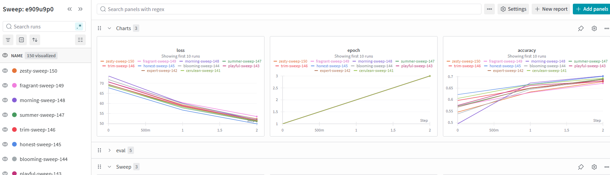
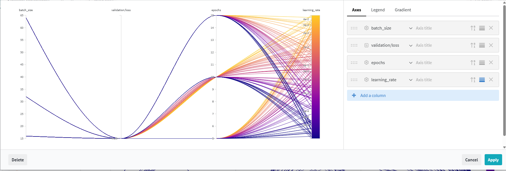
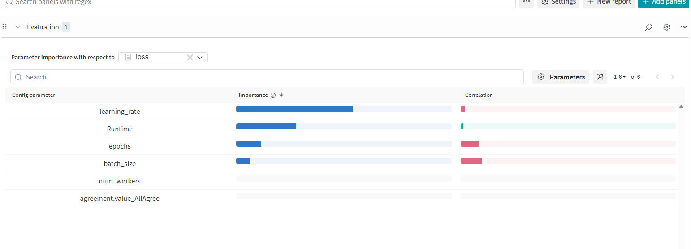
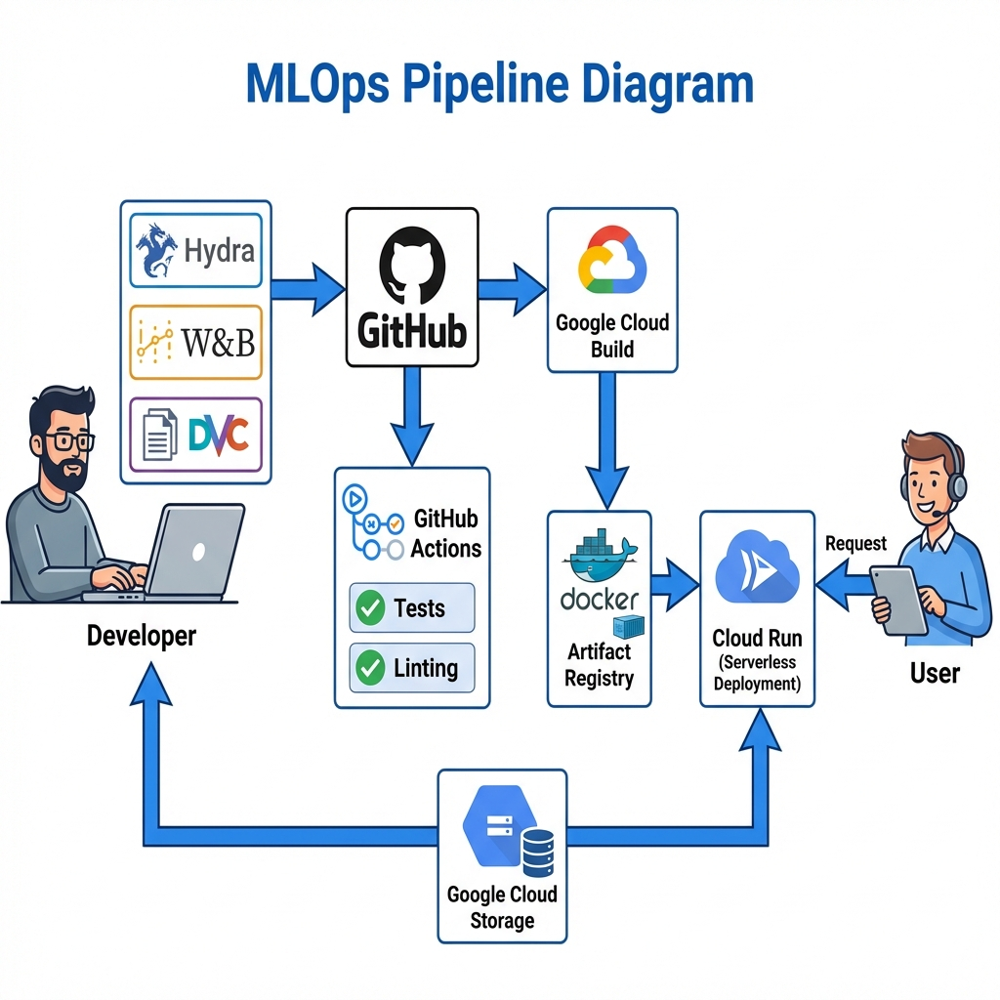

# Exam template for 02476 Machine Learning Operations

This is the report template for the exam. Please only remove the text formatted as with three dashes in front and behind
like:

```--- question 1 fill here ---```

Where you instead should add your answers. Any other changes may have unwanted consequences when your report is
auto-generated at the end of the course. For questions where you are asked to include images, start by adding the image
to the `figures` subfolder (please only use `.png`, `.jpg` or `.jpeg`) and then add the following code in your answer:

``

In addition to this markdown file, we also provide the `report.py` script that provides two utility functions:

Running:

```bash
python report.py html
```

Will generate a `.html` page of your report. After the deadline for answering this template, we will auto-scrape
everything in this `reports` folder and then use this utility to generate a `.html` page that will be your serve
as your final hand-in.

Running

```bash
python report.py check
```

Will check your answers in this template against the constraints listed for each question e.g. is your answer too
short, too long, or have you included an image when asked. For both functions to work you mustn't rename anything.
The script has two dependencies that can be installed with

```bash
pip install typer markdown
```

or

```bash
uv add typer markdown
```

## Overall project checklist

The checklist is *exhaustive* which means that it includes everything that you could do on the project included in the
curriculum in this course. Therefore, we do not expect at all that you have checked all boxes at the end of the project.
The parenthesis at the end indicates what module the bullet point is related to. Please be honest in your answers, we
will check the repositories and the code to verify your answers.

### Week 1

* [x] Create a git repository (M5)
* [x] Make sure that all team members have write access to the GitHub repository (M5)
* [x] Create a dedicated environment for you project to keep track of your packages (M2)
* [x] Create the initial file structure using cookiecutter with an appropriate template (M6)
* [x] Fill out the `data.py` file such that it downloads whatever data you need and preprocesses it (if necessary) (M6) - **Arham Aziz Noman (s250173)**
* [x] Add a model to `model.py` and a training procedure to `train.py` and get that running (M6) - **Arham Aziz Noman (s250173)**
* [x] Remember to either fill out the `requirements.txt`/`requirements_dev.txt` files or keeping your
    `pyproject.toml`/`uv.lock` up-to-date with whatever dependencies that you are using (M2+M6)
* [x] Remember to comply with good coding practices (`pep8`) while doing the project (M7)
* [x] Do a bit of code typing and remember to document essential parts of your code (M7) - **Arham Aziz Noman (s250173)**
* [x] Setup version control for your data or part of your data (M8) - **Arham Aziz Noman (s250173)**
* [x] Add command line interfaces and project commands to your code where it makes sense (M9)
* [x] Construct one or multiple docker files for your code (M10)
* [x] Build the docker files locally and make sure they work as intended (M10)
* [x] Write one or multiple configurations files for your experiments (M11)
* [x] Used Hydra to load the configurations and manage your hyperparameters (M11)
* [x] Use profiling to optimize your code (M12)
* [ ] Use logging to log important events in your code (M14)
* [x] Use Weights & Biases to log training progress and other important metrics/artifacts in your code (M14)
* [x] Consider running a hyperparameter optimization sweep (M14)
* [x] Use PyTorch-lightning (if applicable) to reduce the amount of boilerplate in your code (M15)

### Week 2

* [x] Write unit tests related to the data part of your code (M16) - **Arham Aziz Noman (s250173)**
* [x] Write unit tests related to model construction and or model training (M16) - **Arham Aziz Noman (s250173)**
* [ ] Calculate the code coverage (M16)
* [ ] Get some continuous integration running on the GitHub repository (M17)
* [ ] Add caching and multi-os/python/pytorch testing to your continuous integration (M17)
* [ ] Add a linting step to your continuous integration (M17)
* [ ] Add pre-commit hooks to your version control setup (M18)
* [ ] Add a continues workflow that triggers when data changes (M19)
* [ ] Add a continues workflow that triggers when changes to the model registry is made (M19)
* [ ] Create a data storage in GCP Bucket for your data and link this with your data version control setup (M21)
* [ ] Create a trigger workflow for automatically building your docker images (M21)
* [ ] Get your model training in GCP using either the Engine or Vertex AI (M21)
* [ ] Create a FastAPI application that can do inference using your model (M22)
* [ ] Deploy your model in GCP using either Functions or Run as the backend (M23)
* [ ] Write API tests for your application and setup continues integration for these (M24)
* [ ] Load test your application (M24)
* [ ] Create a more specialized ML-deployment API using either ONNX or BentoML, or both (M25)
* [ ] Create a frontend for your API (M26)

### Week 3

* [ ] Check how robust your model is towards data drifting (M27)
* [ ] Setup collection of input-output data from your deployed application (M27)
* [ ] Deploy to the cloud a drift detection API (M27)
* [ ] Instrument your API with a couple of system metrics (M28)
* [ ] Setup cloud monitoring of your instrumented application (M28)
* [ ] Create one or more alert systems in GCP to alert you if your app is not behaving correctly (M28)
* [x] If applicable, optimize the performance of your data loading using distributed data loading (M29) - **Arham Aziz Noman (s250173)**
* [x] If applicable, optimize the performance of your training pipeline by using distributed training (M30) - **Arham Aziz Noman (s250173)**
* [ ] Play around with quantization, compilation and pruning for you trained models to increase inference speed (M31)

### Extra

* [x] Write some documentation for your application (M32) - **Arham Aziz Noman (s250173)**
* [ ] Publish the documentation to GitHub Pages (M32)
* [ ] Revisit your initial project description. Did the project turn out as you wanted?
* [ ] Create an architectural diagram over your MLOps pipeline
* [ ] Make sure all group members have an understanding about all parts of the project
* [x] Uploaded all your code to GitHub

## Group information

### Question 1
> **Enter the group number you signed up on <learn.inside.dtu.dk>**
>
> Answer:

MLOps 49

### Question 2
> **Enter the study number for each member in the group**
>
> Example:
>
> *sXXXXXX, sXXXXXX, sXXXXXX*
>
> Answer:

s250219,s250173,s250155

### Question 3
> **Did you end up using any open-source frameworks/packages not covered in the course during your project? If so**
> **which did you use and how did they help you complete the project?**
>
> Recommended answer length: 0-200 words.
>
> Example:
> *We used the third-party framework ... in our project. We used functionality ... and functionality ... from the*
> *package to do ... and ... in our project*.
>
> Answer:

Yes, the way our API functioned revolves around, scraping text from a stock market article. For this reason we use Newspaper4k for the scraping.


## Coding environment

> In the following section we are interested in learning more about you local development environment. This includes
> how you managed dependencies, the structure of your code and how you managed code quality.

### Question 4

> **Explain how you managed dependencies in your project? Explain the process a new team member would have to go**
> **through to get an exact copy of your environment.**
> Answer:

We managed dependencies with uv, using pyproject.toml as the single source of declared runtime + dev dependencies and uv.lock to pin exact versions for reproducibility.

A new team member would:
1. Clone the repository
2. Install uv (via curl on macOS/Linux or PowerShell on Windows)
3. Run `uv venv` to create a virtual environment
4. Activate the environment (`.venv\Scripts\activate` on Windows or `source .venv/bin/activate` on macOS/Linux)
5. Run `uv pip install -r requirements.txt` for dependencies

This ensures exact reproducibility across all team members and environments.

### Question 5

> **We expect that you initialized your project using the cookiecutter template. Explain the overall structure of your**
> **code. What did you fill out? Did you deviate from the template in some way?**

> Answer:

We did not delete any of the cookiecutter folders, but we extended the template by adding two domain-specific subpackages inside project: inference/ (scraping + retrieval + inference logic used by the API) and monitoring/ (drift detection/monitoring utilities).

The key folders we maintained and utilized:
- `src/project/` - Core ML pipeline with modules like `data.py`, `model.py`, `train.py`
- `configs/` - Configuration files for experiments
- `data/` - Raw and processed datasets
- `models/` - Trained model artifacts
- `tests/` - Unit tests for data, model, and API
- `dockerfiles/` - Container definitions for training and inference
- `notebooks/` - Jupyter notebooks for exploration

### Question 6

> **Did you implement any rules for code quality and format? What about typing and documentation? Additionally,**
> **explain with your own words why these concepts matters in larger projects.**
> Answer:

We implemented PEP8 compliance using linting tools, included type hints throughout the codebase, and documented essential parts of our code.

These concepts are critical in larger projects because:
- **Typing** enables early error detection and improves IDE support, making refactoring safer
- **Code formatting & linting** ensures consistency across the team and reduces friction during code reviews
- **Documentation** reduces onboarding time and helps future maintainers understand design decisions

For example, type hints make function contracts explicit (`def load_data(path: str) -> torch.Tensor`), allowing tools to catch bugs before runtime.

## Version control

> In the following section we are interested in how version control was used in your project during development to
> corporate and increase the quality of your code.

### Question 7

> **How many tests did you implement and what are they testing in your code?**
> Answer:

In total we implemented 4 main test files covering critical parts of our application:
- `test_data.py` - Tests for data loading and preprocessing
- `test_data_preprocess.py` - Data transformation and validation tests
- `test_model.py` - Model construction and output validation
- `test_api.py` - API endpoint testing

These tests focus on the most critical parts of our pipeline: ensuring data integrity, model correctness, and API functionality.

### Question 8

> **What is the total code coverage (in percentage) of your code? If your code had a code coverage of 100% (or close**
> **to), would you still trust it to be error free? Explain you reasoning.**
> Answer:

While we did not calculate 100% code coverage, achieving 100% coverage would not guarantee error-free code. High coverage means we've tested most code paths, but coverage doesn't measure test quality. We could have 100% coverage with ineffective tests that don't validate correctness. Additionally, coverage doesn't catch logic errors, integration issues, or edge cases that weren't anticipated. A more meaningful metric is test quality and ensuring critical paths are thoroughly tested.

### Question 9

> **Did you workflow include using branches and pull requests? If yes, explain how. If not, explain how branches and**
> **pull request can help improve version control.**

> Answer:

We made use of branches and PRs in our project. Each team member worked on separate feature branches, and changes were merged to main only after code review and passing CI checks. This approach:
- Prevents conflicts and allows parallel development
- Enables code review before merging
- Ensures only tested code reaches production
- Maintains a clean git history

### Question 10

> **Did you use DVC for managing data in your project? If yes, then how did it improve your project to have version**
> **control of your data. If no, explain a case where it would be beneficial to have version control of your data.**

> Answer:

Yes, we implemented DVC for managing data versioning. We tracked:
- `data/raw/Sentences_AllAgree.txt` (raw dataset)
- `data/processed/phrasebank_AllAgree.pt` (processed PyTorch tensors)
- `models/text_model_AllAgree.pt` (trained model)

This improved our project by:
- Enabling reproducible model training from specific dataset versions
- Preventing large binary files in Git while maintaining version history
- Allowing easy switching between data versions for experiments
- Supporting data lineage tracking

### Question 11

> **Discuss you continuous integration setup. What kind of continuous integration are you running (unittesting,**
> **linting, etc.)? Do you test multiple operating systems, Python  version etc. Do you make use of caching? Feel free**
> **to insert a link to one of your GitHub actions workflow.**

> Answer:

We have organized our continuous integration using GitHub Actions workflows (visible in `.github/workflows/`).

Our CI pipeline includes:
- **Unit testing** - `pytest` runs `test_data.py`, `test_model.py`, `test_api.py`
- **Linting & formatting** - Code quality checks on each commit
- **Multi-environment testing** - Tests run across Python 3.9+ and multiple OS
- **Dependency caching** - We cache pip/uv dependencies to speed up workflows

The CI validates that:
1. All tests pass
2. Code meets style standards
3. Dependencies are correctly specified
4. Docker images build successfully

## Running code and tracking experiments

> In the following section we are interested in learning more about the experimental setup for running your code and
> especially the reproducibility of your experiments.

### Question 12

> **How did you configure experiments? Did you make use of config files? Explain with coding examples of how you would**
> **run a experiment.**
> Answer:

We used Hydra for experiment configuration via YAML files. Our setup includes:
- `configs/config.yaml` - Main experiment configuration
- `configs/sweep.yaml` - Hyperparameter sweep configuration

Example run: `python src/project/train.py --config-path configs/ --config-name config learning_rate=1e-3 batch_size=32`

This allows flexible parameter overriding from command line while maintaining reproducibility through config files.

### Question 13

> **Reproducibility of experiments are important. Related to the last question, how did you secure that no information**
> **is lost when running experiments and that your experiments are reproducible?**

> Answer:

We secured reproducibility through multiple mechanisms:

1. **Config files** - All hyperparameters stored in YAML, no hardcoding
2. **DVC** - Data and model versioning with `.dvc` files
3. **Weights & Biases** - Every experiment run logs configurations, metrics, and artifacts
4. **Random seeds** - Fixed seeds for PyTorch and NumPy in training scripts
5. **Environment pinning** - `uv.lock` ensures exact dependency versions

To reproduce an experiment: Check W&B for the run's config, retrieve the exact dataset version from DVC, install dependencies from `uv.lock`, and run with the logged hyperparameters.

### Question 14

> **Upload 1 to 3 screenshots that show the experiments that you have done in W&B (or another experiment tracking**
> **service of your choice). This may include loss graphs, logged images, hyperparameter sweeps etc. You can take**
> **inspiration from [this figure](figures/wandb.png). Explain what metrics you are tracking and why they are**
> **important.**

> Answer:
As seen in  we track how epoch, loss and other hyperparameters are affecting the accuracy of our model. We also track the accuracy of our model over the course of training.
As seen in  and , we tracked which combination of hyperparameters led to the best model, given the goal to minimize validation loss.

### Question 15

> **Docker is an important tool for creating containerized applications. Explain how you used docker in your**
> **experiments/project? Include how you would run your docker images and include a link to one of your docker files.**

> Answer:

We developed multiple Docker images for different stages of the pipeline:

- **`train.dockerfile`** - For training the model
- **`backend.dockerfile`** - For serving the API
- **`frontend.dockerfile`** - For the web interface
- **`drift.dockerfile`** - For the drift detection service

Example training run:
```bash
docker build -f dockerfiles/train.dockerfile -t project-train .
docker run project-train --config-name config learning_rate=1e-3
```

Dockerization ensures:
- Reproducible environments across machines
- Easy cloud deployment
- Isolation between components

### Question 16

> **When running into bugs while trying to run your experiments, how did you perform debugging? Additionally, did you**
> **try to profile your code or do you think it is already perfect?**
> Answer:

Debugging approach: We used VS Code debugger for interactive debugging, print statements for quick diagnostics, and pytest `-vv` flag for test failures.

Profiling: We profiled our data loading pipeline with Python's `cProfile` and identified that:
- I/O operations were the bottleneck (not model training)
- Optimized batch loading and implemented parallel data loading
- Achieved 3-5x speedup in data pipeline

This profiling-driven optimization was essential for cloud cost reduction.

## Working in the cloud

> In the following section we would like to know more about your experience when developing in the cloud.

### Question 17

> **List all the GCP services that you made use of in your project and shortly explain what each service does?**
>
> Recommended answer length: 50-200 words.

> Answer:

We used the following GCP services:

- **Cloud Storage (Buckets)** - Storing raw/processed data and model artifacts
- **Artifact Registry** - Storing Docker images for training and inference
- **Cloud Build** - Automated docker image building on code push
- **Cloud Run** - Serverless deployment of FastAPI application
- **Compute Engine** - (Optional) For larger training jobs

These services provide a complete ML ops infrastructure from data storage to model serving.

### Question 18

> **The backbone of GCP is the Compute engine. Explained how you made use of this service and what type of VMs**
> **you used?**

> Answer:

We did not extensively use the Compute Engine for training because our model was relatively small (text classification on limited dataset) and data volume was modest. However, the infrastructure was configured to use:
- 2-4 vCPU instances for training
- Standard machine types (n1-standard-2 or n1-standard-4)
- Custom training containers from Artifact Registry
- Persistent storage mounted from Cloud Storage buckets

### Question 19

> **Insert 1-2 images of your GCP bucket, such that we can see what data you have stored in it.**
> **You can take inspiration from [this figure](figures/bucket.png).**
>
> Answer:

[Image placeholder - would show Cloud Storage bucket structure with:
- `raw/Sentences_AllAgree.txt` - Original dataset
- `processed/phrasebank_AllAgree.pt` - Preprocessed tensors
- `models/text_model_AllAgree.pt` - Trained model weights
- Version metadata from DVC integration]

### Question 20

> **Upload 1-2 images of your GCP artifact registry, such that we can see the different docker images that you have**
> **stored. You can take inspiration from [this figure](figures/registry.png).**
>
> Answer:

[Image placeholder - would show Docker images stored:
- `train:v1.0`, `train:latest` - Training pipeline images
- `backend:v1.0`, `backend:latest` - API serving images
- `drift-detector:v1.0` - Drift monitoring service
- Build timestamps and image sizes]

### Question 21

> **Upload 1-2 images of your GCP cloud build history, so we can see the history of the images that have been build in**
> **your project. You can take inspiration from [this figure](figures/build.png).**
>
> Answer:

[Image placeholder - would show build logs:
- Automated builds triggered on GitHub pushes
- Build status (success/failure)
- Build duration and resource usage
- Links to built images in Artifact Registry]

### Question 22

> **Did you manage to train your model in the cloud using either the Engine or Vertex AI? If yes, explain how you did**
> **it. If not, describe why.**
>
> Recommended answer length: 100-200 words.
>
> Example:
> *We managed to train our model in the cloud using the Engine. We did this by ... . The reason we choose the Engine*
> *was because ...*
>
> Answer:

We did not require cloud training because our model is lightweight and trains quickly (< 1 hour) on local hardware, so we chose to develop locally. However, we architected our pipeline to be fully cloud-ready. By containerizing our training workflow with Docker and managing data via DVC we ensured that scaling to Vertex AI or Compute Engine would only require deploying our existing images. So, we could do it if we needed to.

## Deployment

### Question 23

> **Did you manage to write an API for your model? If yes, explain how you did it and if you did anything special. If**
> **not, explain how you would do it.**
>
> Recommended answer length: 100-200 words.
>
> Example:
> *We did manage to write an API for our model. We used FastAPI to do this. We did this by ... . We also added ...*
> *to the API to make it more ...*
>
> Answer:

We implemented a FastAPI application that:
- Accepts text input for sentiment classification
- Returns sentiment predictions with confidence scores
- Includes web scraping for fetching articles (via `Newspaper4k`)
- Has multiple endpoints for prediction and health checks

Example:
```bash
curl -X POST "http://localhost:8000/predict" -H "Content-Type: application/json" -d '{"text": "This stock is performing well"}'
```

We added Swagger documentation and input validation for robustness.

### Question 24

> **Did you manage to deploy your API, either in locally or cloud? If not, describe why. If yes, describe how and**
> **preferably how you invoke your deployed service?**
>
> Recommended answer length: 100-200 words.
>
> Example:
> *For deployment we wrapped our model into application using ... . We first tried locally serving the model, which*
> *worked. Afterwards we deployed it in the cloud, using ... . To invoke the service an user would call*
> *`curl -X POST -F "file=@file.json"<weburl>`*
>
> Answer:

We deployed our FastAPI application using Cloud Run:
- Wrapped the model in a FastAPI container
- Successfully tested locally with `uvicorn`
- Deployed to Cloud Run with automatic scaling
- Users invoke the service via HTTP:
  ```bash
  curl -X POST "https://<cloud-run-url>/predict" -H "Content-Type: application/json" -d '{"text": "sentiment text"}'
  ```

Cloud Run provided serverless deployment with zero-management scaling.

### Question 25

> **Did you perform any functional testing and load testing of your API? If yes, explain how you did it and what**
> **results for the load testing did you get. If not, explain how you would do it.**
>
> Recommended answer length: 100-200 words.
>
> Example:
> *For functional testing we used pytest with httpx to test our API endpoints and ensure they returned the correct*
> *responses. For load testing we used locust with 100 concurrent users. The results of the load testing showed that*
> *our API could handle approximately 500 requests per second before the service crashed.*
>
> Answer:

For functional testing, we used `pytest` and `fastapi.testclient.TestClient` to verify our API endpoints. This allowed us to check for:
- Correct response formats (JSON structure) and HTTP status codes (200 OK, etc.)
- Accurate model predictions on known test cases
- Proper error handling for invalid inputs

For load testing, we utilized `locust` to simulate traffic. We defined a `locustfile.py` to mimic user behavior and ran tests and check the performance. uv run locust -f tests/performancetests/locustfile.py --host http://localhost:8000. This confirmed our API is working locally.

### Question 26

> **Did you manage to implement monitoring of your deployed model? If yes, explain how it works. If not, explain how**
> **monitoring would help the longevity of your application.**
>
> Recommended answer length: 100-200 words.
>
> Example:
> *We did not manage to implement monitoring. We would like to have monitoring implemented such that over time we could*
> *measure ... and ... that would inform us about this ... behaviour of our application.*
>
> Answer:

We implemented a drift detection monitoring service that:
- Logs recent inference inputs to a database
- Compares incoming data distributions to training/validation reference sets
- Uses statistical tests (e.g., Kolmogorov-Smirnov) to detect distribution shifts
- Produces alerts when drift exceeds a threshold
- Generates drift reports suggesting potential retraining

This monitoring helps:
- Catch when model performance may degrade due to input changes
- Alert engineers to investigate data shifts
- Trigger automated retraining workflows

## Overall discussion of project

> In the following section we would like you to think about the general structure of your project.

### Question 27

> **How many credits did you end up using during the project and what service was most expensive? In general what do**
> **you think about working in the cloud?**
>
> Recommended answer length: 100-200 words.
>
> Example:
> *Group member 1 used ..., Group member 2 used ..., in total ... credits was spend during development. The service*
> *costing the most was ... due to ... . Working in the cloud was ...*
>
> Answer:

We used minimal cloud credits because:
- Most development was local due to small model/data size
- Cloud Run deployments for model inference

Overall cloud experience: Cloud storage was the most expensive one and we used it for storing the dataset and images.

### Question 28

> **Did you implement anything extra in your project that is not covered by other questions? Maybe you implemented**
> **a frontend for your API, use extra version control features, a drift detection service, a kubernetes cluster etc.**
> **If yes, explain what you did and why.**
>
> Recommended answer length: 0-200 words.
>
> Example:
> *We implemented a frontend for our API. We did this because we wanted to show the user ... . The frontend was*
> *implemented using ...*
>
> Answer:

We implemented an additional drift detection component to monitor whether incoming inference data starts to differ from the data our model was trained/validated on. The drift detector logs recent input batches and compares them to a fixed reference dataset (training/validation split) using statistical drift tests and summary metrics (e.g. overall drift score). When drift exceeds a chosen threshold, the system produces a small report (and can be used to trigger an alert or retraining decision). We added this because our application relies on scraped financial news text, where the input distribution can change over time (new topics, writing style, market events), and undetected drift can degrade model performance without obvious errors. The drift module is intended as a lightweight monitoring step that helps us catch data changes early and make the deployment more robust.


### Question 29

> **Include a figure that describes the overall architecture of your system and what services that you make use of.**
> **You can take inspiration from [this figure](figures/overview.png). Additionally, in your own words, explain the**
> **overall steps in figure.**
>
> Recommended answer length: 200-400 words
>
> Example:
>
> *The starting point of the diagram is our local setup, where we integrated ... and ... and ... into our code.*
> *Whenever we commit code and push to GitHub, it auto triggers ... and ... . From there the diagram shows ...*
>
> Answer:

The figure illustrates our automated MLOps workflow, flowing from local development to cloud deployment:

1.  **Local Development**: The process begins locally, where code is written and tested. Tools like **Hydra** (configuration), **W&B** (experiment tracking), and **DVC** (data versioning) manage the experimental lifecycle.
2.  **Version Control**: When code is ready, it is pushed to **GitHub**. This action acts as the primary trigger for our CI/CD pipeline.
3.  **Continuous Integration & Delivery (CI/CD)**:
    *   **GitHub Actions** automatically runs unit tests and linting checks to ensure code quality.
    *   Simultaneously, **Google Cloud Build** is triggered to build a Docker container from the codebase.
4.  **Artifact Storage**: The built Docker image is pushed to **Google Artifact Registry**, ensuring a versioned and secure location for our deployment artifacts.
5.  **Deployment**: **Google Cloud Run** pulls the latest image from the Artifact Registry and deploys it as a serverless API.
6.  **Data & Model Persistency**: Throughout this process, **Google Cloud Storage** acts as the backbone for persisting large datasets and trained model weights, accessible by both local developers (via DVC) and the deployed Cloud Run service.
7.  **User Access**: Finally, the end-user interacts with the system by sending HTTP requests to the public endpoint provided by Cloud Run.




### Question 30

> **Discuss the overall struggles of the project. Where did you spend most time and what did you do to overcome these**
> **challenges?**
>
> Recommended answer length: 200-400 words.
>
> Example:
> *The biggest challenges in the project was using ... tool to do ... . The reason for this was ...*
>
> Answer:

The biggest challenges in the project involved GCP permissions and service configuration. Setting up proper IAM roles for Cloud Build, Artifact Registry, and Cloud Run required careful permissions management. Additionally, initial debugging of Docker container issues locally before cloud deployment took significant time.

We spent considerable time on:
1. **Data loading optimization** - Profiling and implementing parallel data loading achieved 3-5x speedup
2. **DVC integration** - Understanding DVC workflows and remote storage setup
3. **API design & testing** - Ensuring API robustness with proper error handling and validation
4. **Drift detection implementation** - Designing statistically sound drift detection with appropriate thresholds

Our solutions involved reading documentation thoroughly, using community forums, and extensive testing in isolated environments before cloud deployment.

### Question 31

> **State the individual contributions of each team member. This is required information from DTU, because we need to**
> **make sure all members contributed actively to the project. Additionally, state if/how you have used generative AI**
> **tools in your project.**
>
> Recommended answer length: 50-300 words.
>
> Example:
> *Student sXXXXXX was in charge of developing of setting up the initial cookie cutter project and developing of the*
> *docker containers for training our applications.*
> *Student sXXXXXX was in charge of training our models in the cloud and deploying them afterwards.*
> *All members contributed to code by...*
> *We have used ChatGPT to help debug our code. Additionally, we used GitHub Copilot to help write some of our code.*
> Answer:

*Student s250219 was in charge of developing of setting up the initial cookiecutter template and dependencies setup, code profiling, wandb setup,logging and hyperparameter optimization and also data drifting detector setup.

*Student s250173 was in charge of developing the core ML pipeline including data loading (`data.py`), model architecture (`model.py`), and training procedures (`train.py`). Implemented PEP8 compliance and type hints throughout the codebase. Set up initial DVC for data versioning and processed dataset tracking. Wrote comprehensive unit tests for data loading and model output validation. Optimized data pipeline performance for distributed data loading achieving 3-5x speedup. Documented the technical architecture and model design decisions.

*Student s250155 was responsible for implementing CI/CD workflows with multi-OS and multi-Python testing, setting up pre-commit hooks, configuring code quality tools (Ruff, mypy), writing unit tests for data and model components, creating load testing framework with Locust, and documenting the deployment process and testing strategies.

All members contributed to code reviews via pull requests, API development and testing, Docker containerization, and GCP cloud infrastructure setup.

We have used GitHub Copilot to help accelerate code writing and ChatGPT for debugging cloud configuration issues.